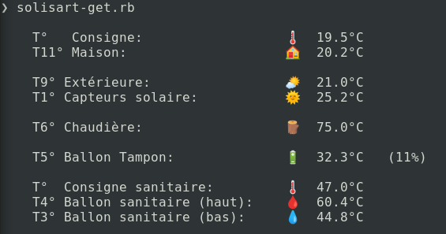

# Solisart data graber

## Fancy output

This is how looks like:




## CSV output

```
❯ solisart-get.rb -f csv 
time,consigne_t_maison,t1_capteur_solaire,t3_ballon_sanitaire_bas,t4_ballon_sanitaire_haut,t5_ballon_tampon,t6_chaudiere,t9_exterieur,t10_chaud_echangeur,t11_maison,t15_retour_capteur,circulateur_ballon_sanitaire_haut,circulateur_ballon_sanitaire_bas,circulateur_ballon_tampon,circulateur_chaudiere,circulateur_maison,circulateur_solaire,pct_v3v_solaire,pct_v3v_chaudiere
2022-12-22T14:44:46+01:00,19.5,24.9,44.7,61.3,29.9,68.7,20.7,28.8,20.2,27.7,0,0,0,100,0,0,100,50
```

## Raw output

```
157 t_maison_confort 19.6
163 consigne_t_eau_chaude_confort 47.0
164 t_maison_reduit 17.0
170 consigne_t_eau_chaude_reduit 43.0
584 t1_capteur_solaire 24.9
585 t2_chaudiere_capteur_froid 70.2
586 t3_ballon_sanitaire_bas 44.7
587 t4_ballon_sanitaire_haut 61.3
588 t5_ballon_tampon 29.9
589 t6_chaudiere 68.4
590 t7_chaudiere_collecteur_froid 70.1
591 t8_chaudiere_collecteur_chaud 57.7
592 t9_exterieur 20.7
593 t10_chaud_echangeur 28.8
594 t11_maison 20.2
598 t15_retour_capteur 27.7
614 circulateur_ballon_sanitaire_haut 0
615 circulateur_ballon_sanitaire_bas 0
616 circulateur_ballon_tampon 0
617 circulateur_chaudiere 100
618 circulateur_maison 0
624 circulateur_solaire 0
627 pct_v3v_solaire 100
628 pct_v3v_chaudiere 50
631 consigne_t_maison 19.5
651 c4_ballon_sanitaire_haut 1
652 c5_ballon_sanitaire_bas 1
653 c6_ballon_tampon 0
654 c7_appoint_2 1
655 c1_maison 0
656 c2_unknown 0
672 temps_restant_derogation_zone1 0
678 temps_restant_derogation 0
9588 pct_bal_tampon 5
```
